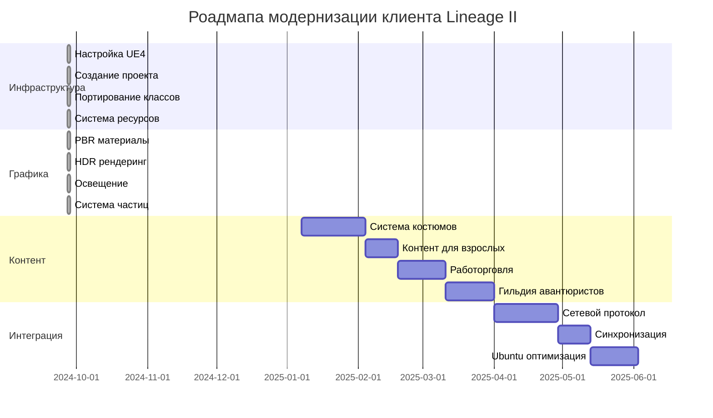
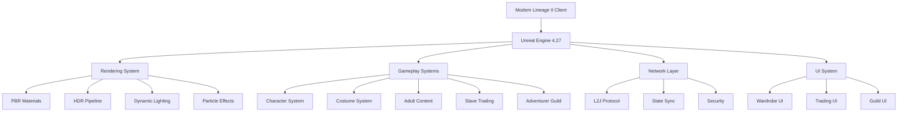
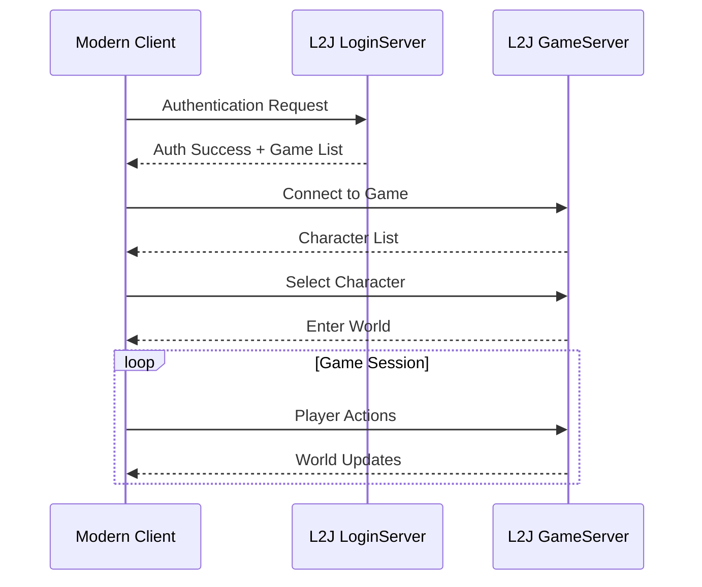

# 🚀 Модернизация клиента Lineage II

## 📋 Связанные документы
- [[Роадмапа-проекта]]
- [[Техническое-задание-обновленное]]
- [[Архитектура-сервера]]

## 🎯 Цель проекта
Создание современного клиента Lineage II на базе деобфусцированного кода с:
- Современной графикой (PBR, HDR, 4K)
- Уникальными игровыми системами
- Контентом для взрослых
- Поддержкой Ubuntu Linux

## 📊 Прогресс модернизации



## 🏗️ Архитектура нового клиента



## 👗 Система костюмов (BnS-стиль)

### Особенности системы
- **Слотная система**: Верх, Низ, Обувь, Аксессуары
- **Комбинирование**: Смешивание элементов разных костюмов
- **Предварительный просмотр**: 3D модель в реальном времени
- **Коллекции**: Тематические наборы костюмов

### Технические детали
```cpp
struct FCostumeSlot {
    ESlotType SlotType;      // Верх, Низ, Обувь
    USkeletalMesh* Mesh;     // 3D модель
    TArray<UMaterial*> Materials; // Материалы
    bool bIsAdultContent;    // Контент 18+
};
```

## 🔞 Контент для взрослых

### Технические особенности
- **Высокодетализированные модели**: Реалистичная анатомия
- **Физика тела**: Cloth simulation для реалистичного движения
- **Расширенные анимации**: Дополнительные анимации движения
- **Морфинг**: Настройка пропорций тела
- **Возрастные ограничения**: Система проверки возраста

### Реализация
```cpp
class UAdultContentManager {
    void EnableAdultContent(bool bEnable);
    void ApplyDetailedFemaleModel();
    void ConfigurePhysicsSimulation();
    void SetupClothSimulation();
};
```

## 🏪 Система работорговли

### Концепция (аниме фентези)
- **Невольничий рынок**: Покупка/продажа рабов
- **Типы рабов**: Боевые, хозяйственные, декоративные
- **Система лояльности**: Отношения раб-хозяин
- **Управление**: Команды и задания для рабов
- **Восстания**: Возможность бунта при низкой лояльности

### Игровая механика
```cpp
struct FSlaveData {
    FString Name;
    int32 Level;
    TArray<FString> Skills;
    int32 Price;
    int32 Loyalty;
    ESlaveType Type; // Warrior, Maid, Craftsman
};
```

## 🗡️ Гильдия авантюристов

### Система найма спутников
- **Разнообразие классов**: Воин, Маг, Лучник, Клерик, Вор
- **Индивидуальность**: Уникальные характеры и специализации
- **Развитие отношений**: Система дружбы и романтики
- **Групповая тактика**: Координация в бою
- **Квесты гильдии**: Специальные задания

### AI спутников
```cpp
class ACompanionCharacter {
    void SetCombatRole(ECombatRole Role);
    void UpdateRelationship(int32 Value);
    void ExecuteGroupTactic();
    void LevelUpSkills();
};
```

## 🌐 Сетевая интеграция

### Протокол L2J
- **Совместимость**: Работа с существующими L2J серверами
- **Шифрование**: Безопасная передача данных
- **Оптимизация**: Минимизация сетевого трафика
- **Синхронизация**: Реального времени состояние игры

### Архитектура сети


## 🐧 Ubuntu оптимизация

### Системные требования
- **ОС**: Ubuntu 20.04+ / Debian 11+
- **Процессор**: Intel Core i5-8400 / AMD Ryzen 5 2600
- **Память**: 8 ГБ RAM (16 ГБ рекомендуется)
- **Видеокарта**: GTX 1060 / RX 580 (4 ГБ VRAM)
- **Диск**: 70 ГБ свободного места (SSD рекомендуется)

### Оптимизации
```cpp
class ULinuxOptimizer {
    void ConfigureVulkanRenderer();
    void OptimizeMemoryUsage();
    void EnableLinuxSpecificFeatures();
    void SetupMultithreading();
};
```

## 📈 Ожидаемые результаты

### Производительность
- **FPS**: 60+ при 1080p, 30+ при 4K
- **Загрузка**: Время загрузки -50%
- **Память**: Оптимизация использования -30%
- **Сеть**: Снижение трафика -40%

### Качество графики
- **Освещение**: Реалистичное PBR освещение
- **Материалы**: Физически корректные материалы
- **Эффекты**: Современные визуальные эффекты
- **Разрешение**: Поддержка 4K+ мониторов

### Уникальные особенности
- **Костюмы**: Система как в Blade & Soul
- **Взрослый контент**: Детализированные модели
- **Работорговля**: Уникальная игровая механика
- **Спутники**: Умные AI компаньоны

## 🎯 Следующие действия

1. **Настройка среды** - установка Unreal Engine 4.27
2. **Создание проекта** - базовая структура
3. **Портирование кода** - перенос из деобфусцированных файлов
4. **Итеративная разработка** - пошаговая реализация

---

*Документ обновлен: 2024-09-27*
*Версия: 1.0*
*Статус: В разработке*
