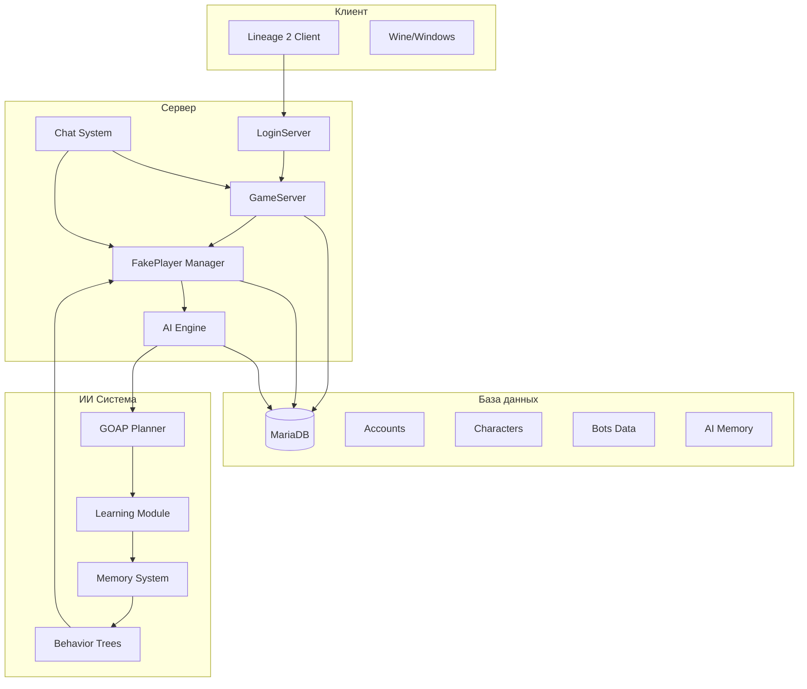

# 🏗️ Архитектура сервера

## Общая схема

## Компоненты системы

### 1. LoginServer
- Аутентификация игроков
- Управление сессиями
- Регистрация GameServer

### 2. GameServer
- Игровая логика
- Мир и объекты
- Сетевые пакеты

### 3. FakePlayer Manager
- Управление ботами
- Спавн/деспавн
- Жизненный цикл

### 4. AI Engine
- Планирование действий
- Обучение и адаптация
- Принятие решений

### 5. Chat System
- Команды управления
- Общение ботов
- Русскоязычные ответы
