# 🔗 Интеграция с L2J сервером

## 📋 Обзор

Этот документ описывает процесс интеграции системы ботов с L2J GameServer и визуализирует контракты взаимодействия.

## 🏗️ Архитектура интеграции

### Общая схема интеграции

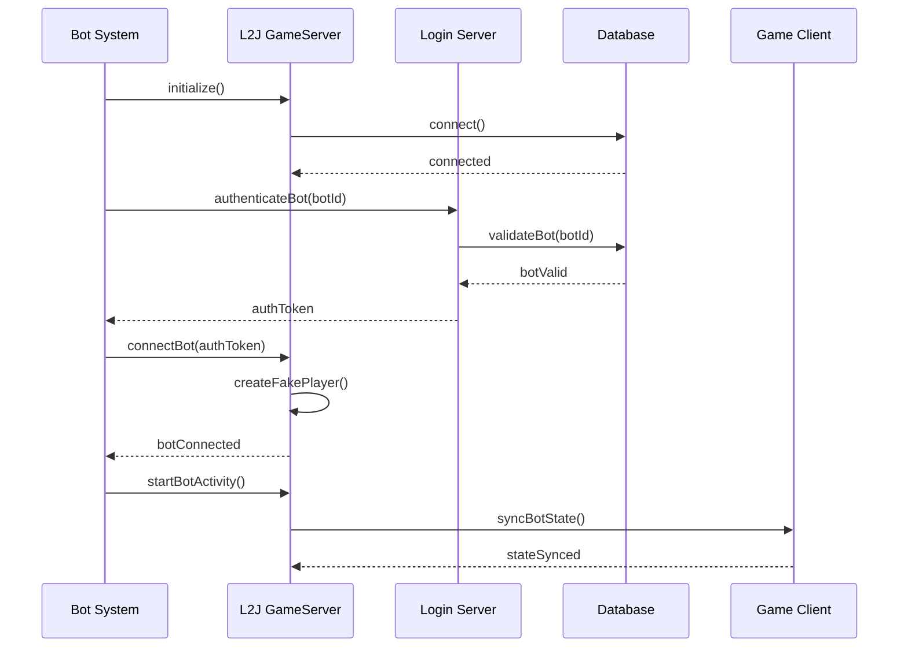
```mermaid
sequenceDiagram
    participant BotSystem as Bot System
    participant L2JGameServer as L2J GameServer
    participant LoginServer as Login Server
    participant Database as Database
    participant Client as Game Client

    BotSystem->>L2JGameServer: initialize()
    L2JGameServer->>Database: connect()
    Database-->>L2JGameServer: connected
    
    BotSystem->>LoginServer: authenticateBot(botId)
    LoginServer->>Database: validateBot(botId)
    Database-->>LoginServer: botValid
    LoginServer-->>BotSystem: authToken
    
    BotSystem->>L2JGameServer: connectBot(authToken)
    L2JGameServer->>L2JGameServer: createFakePlayer()
    L2JGameServer-->>BotSystem: botConnected
    
    BotSystem->>L2JGameServer: startBotActivity()
    L2JGameServer->>Client: syncBotState()
    Client-->>L2JGameServer: stateSynced
```

## 🎮 Игровые действия

### Движение бота

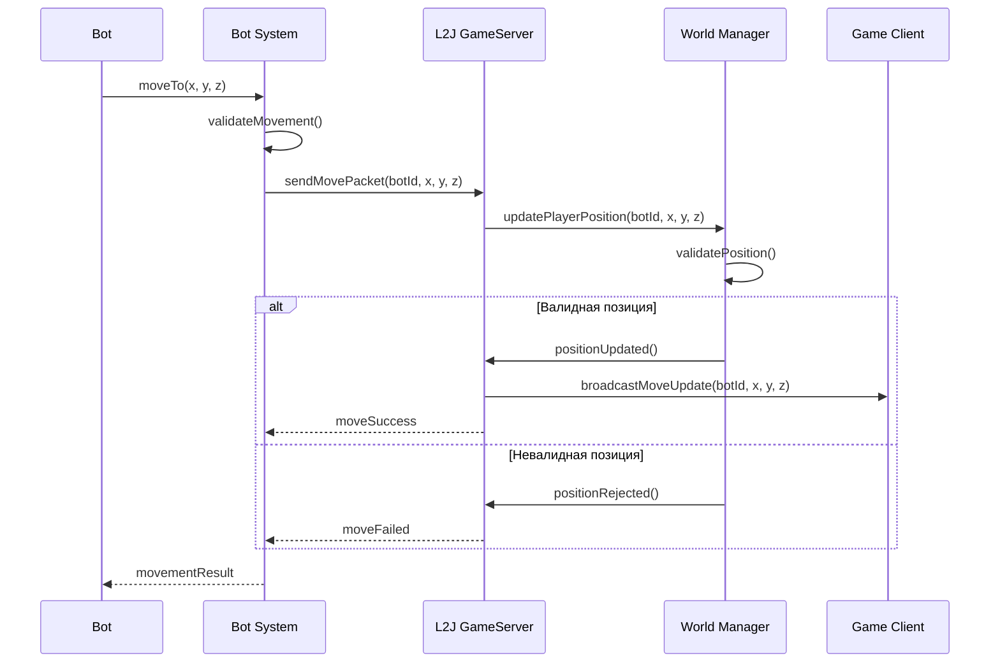
```mermaid
sequenceDiagram
    participant Bot as Bot
    participant BotSystem as Bot System
    participant L2JGameServer as L2J GameServer
    participant WorldManager as World Manager
    participant Client as Game Client

    Bot->>BotSystem: moveTo(x, y, z)
    BotSystem->>BotSystem: validateMovement()
    
    BotSystem->>L2JGameServer: sendMovePacket(botId, x, y, z)
    L2JGameServer->>WorldManager: updatePlayerPosition(botId, x, y, z)
    WorldManager->>WorldManager: validatePosition()
    
    alt Валидная позиция
        WorldManager->>L2JGameServer: positionUpdated()
        L2JGameServer->>Client: broadcastMoveUpdate(botId, x, y, z)
        L2JGameServer-->>BotSystem: moveSuccess
    else Невалидная позиция
        WorldManager->>L2JGameServer: positionRejected()
        L2JGameServer-->>BotSystem: moveFailed
    end
    
    BotSystem-->>Bot: movementResult
```

### Атака бота

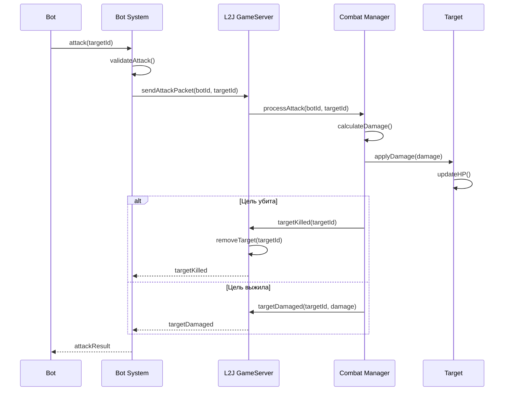
```mermaid
sequenceDiagram
    participant Bot as Bot
    participant BotSystem as Bot System
    participant L2JGameServer as L2J GameServer
    participant CombatManager as Combat Manager
    participant Target as Target

    Bot->>BotSystem: attack(targetId)
    BotSystem->>BotSystem: validateAttack()
    
    BotSystem->>L2JGameServer: sendAttackPacket(botId, targetId)
    L2JGameServer->>CombatManager: processAttack(botId, targetId)
    
    CombatManager->>CombatManager: calculateDamage()
    CombatManager->>Target: applyDamage(damage)
    Target->>Target: updateHP()
    
    alt Цель убита
        CombatManager->>L2JGameServer: targetKilled(targetId)
        L2JGameServer->>L2JGameServer: removeTarget(targetId)
        L2JGameServer-->>BotSystem: targetKilled
    else Цель выжила
        CombatManager->>L2JGameServer: targetDamaged(targetId, damage)
        L2JGameServer-->>BotSystem: targetDamaged
    end
    
    BotSystem-->>Bot: attackResult
```

### Использование умений

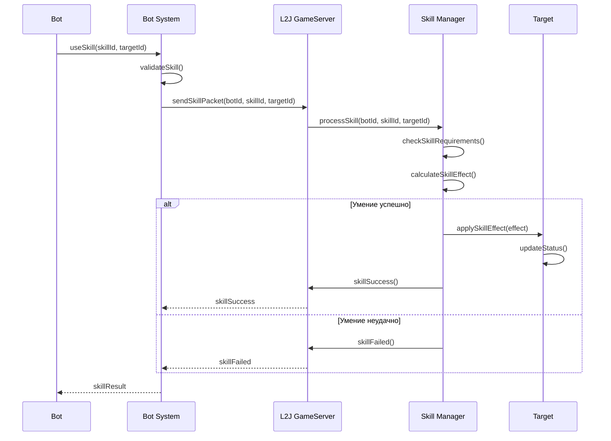
```mermaid
sequenceDiagram
    participant Bot as Bot
    participant BotSystem as Bot System
    participant L2JGameServer as L2J GameServer
    participant SkillManager as Skill Manager
    participant Target as Target

    Bot->>BotSystem: useSkill(skillId, targetId)
    BotSystem->>BotSystem: validateSkill()
    
    BotSystem->>L2JGameServer: sendSkillPacket(botId, skillId, targetId)
    L2JGameServer->>SkillManager: processSkill(botId, skillId, targetId)
    
    SkillManager->>SkillManager: checkSkillRequirements()
    SkillManager->>SkillManager: calculateSkillEffect()
    
    alt Умение успешно
        SkillManager->>Target: applySkillEffect(effect)
        Target->>Target: updateStatus()
        SkillManager->>L2JGameServer: skillSuccess()
        L2JGameServer-->>BotSystem: skillSuccess
    else Умение неудачно
        SkillManager->>L2JGameServer: skillFailed()
        L2JGameServer-->>BotSystem: skillFailed
    end
    
    BotSystem-->>Bot: skillResult
```

## 💬 Система чата

### Отправка сообщения

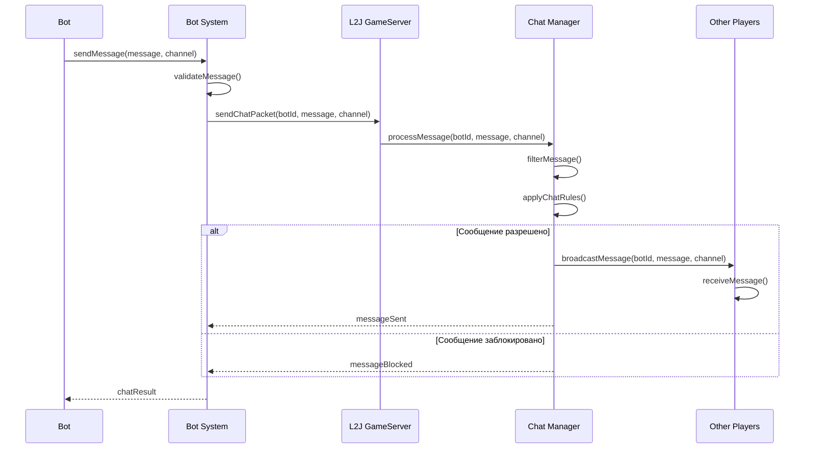
```mermaid
sequenceDiagram
    participant Bot as Bot
    participant BotSystem as Bot System
    participant L2JGameServer as L2J GameServer
    participant ChatManager as Chat Manager
    participant OtherPlayers as Other Players

    Bot->>BotSystem: sendMessage(message, channel)
    BotSystem->>BotSystem: validateMessage()
    
    BotSystem->>L2JGameServer: sendChatPacket(botId, message, channel)
    L2JGameServer->>ChatManager: processMessage(botId, message, channel)
    
    ChatManager->>ChatManager: filterMessage()
    ChatManager->>ChatManager: applyChatRules()
    
    alt Сообщение разрешено
        ChatManager->>OtherPlayers: broadcastMessage(botId, message, channel)
        OtherPlayers->>OtherPlayers: receiveMessage()
        ChatManager-->>BotSystem: messageSent
    else Сообщение заблокировано
        ChatManager-->>BotSystem: messageBlocked
    end
    
    BotSystem-->>Bot: chatResult
```

### Обработка входящих сообщений

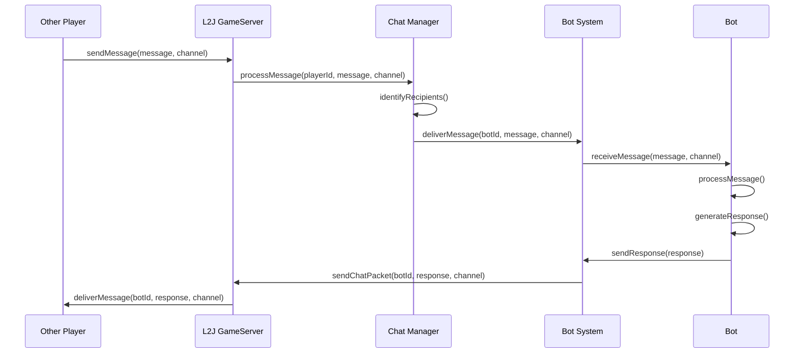
```mermaid
sequenceDiagram
    participant OtherPlayer as Other Player
    participant L2JGameServer as L2J GameServer
    participant ChatManager as Chat Manager
    participant BotSystem as Bot System
    participant Bot as Bot

    OtherPlayer->>L2JGameServer: sendMessage(message, channel)
    L2JGameServer->>ChatManager: processMessage(playerId, message, channel)
    
    ChatManager->>ChatManager: identifyRecipients()
    ChatManager->>BotSystem: deliverMessage(botId, message, channel)
    
    BotSystem->>Bot: receiveMessage(message, channel)
    Bot->>Bot: processMessage()
    Bot->>Bot: generateResponse()
    
    Bot->>BotSystem: sendResponse(response)
    BotSystem->>L2JGameServer: sendChatPacket(botId, response, channel)
    L2JGameServer->>OtherPlayer: deliverMessage(botId, response, channel)
```

## 🎒 Система инвентаря

### Получение предмета

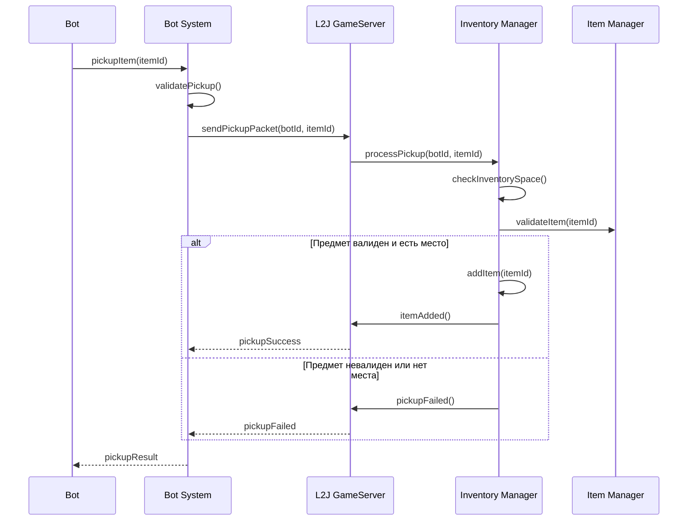
```mermaid
sequenceDiagram
    participant Bot as Bot
    participant BotSystem as Bot System
    participant L2JGameServer as L2J GameServer
    participant InventoryManager as Inventory Manager
    participant ItemManager as Item Manager

    Bot->>BotSystem: pickupItem(itemId)
    BotSystem->>BotSystem: validatePickup()
    
    BotSystem->>L2JGameServer: sendPickupPacket(botId, itemId)
    L2JGameServer->>InventoryManager: processPickup(botId, itemId)
    
    InventoryManager->>InventoryManager: checkInventorySpace()
    InventoryManager->>ItemManager: validateItem(itemId)
    
    alt Предмет валиден и есть место
        InventoryManager->>InventoryManager: addItem(itemId)
        InventoryManager->>L2JGameServer: itemAdded()
        L2JGameServer-->>BotSystem: pickupSuccess
    else Предмет невалиден или нет места
        InventoryManager->>L2JGameServer: pickupFailed()
        L2JGameServer-->>BotSystem: pickupFailed
    end
    
    BotSystem-->>Bot: pickupResult
```

### Использование предмета

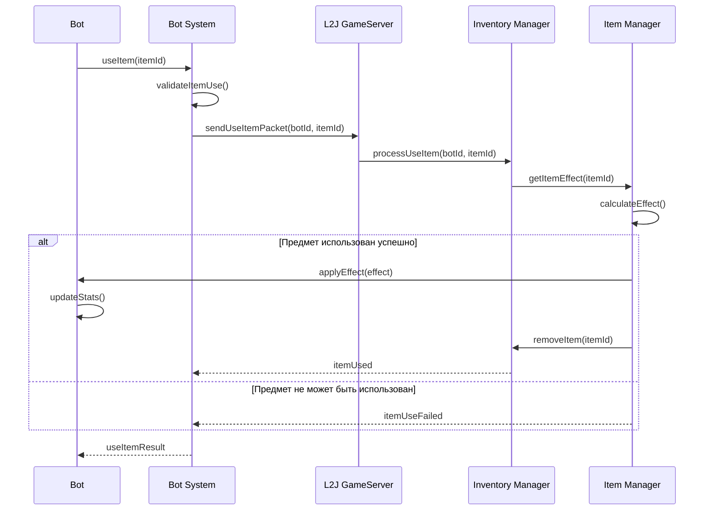
```mermaid
sequenceDiagram
    participant Bot as Bot
    participant BotSystem as Bot System
    participant L2JGameServer as L2J GameServer
    participant InventoryManager as Inventory Manager
    participant ItemManager as Item Manager

    Bot->>BotSystem: useItem(itemId)
    BotSystem->>BotSystem: validateItemUse()
    
    BotSystem->>L2JGameServer: sendUseItemPacket(botId, itemId)
    L2JGameServer->>InventoryManager: processUseItem(botId, itemId)
    
    InventoryManager->>ItemManager: getItemEffect(itemId)
    ItemManager->>ItemManager: calculateEffect()
    
    alt Предмет использован успешно
        ItemManager->>Bot: applyEffect(effect)
        Bot->>Bot: updateStats()
        ItemManager->>InventoryManager: removeItem(itemId)
        InventoryManager-->>BotSystem: itemUsed
    else Предмет не может быть использован
        ItemManager-->>BotSystem: itemUseFailed
    end
    
    BotSystem-->>Bot: useItemResult
```

## 🏰 Система кланов

### Создание клана

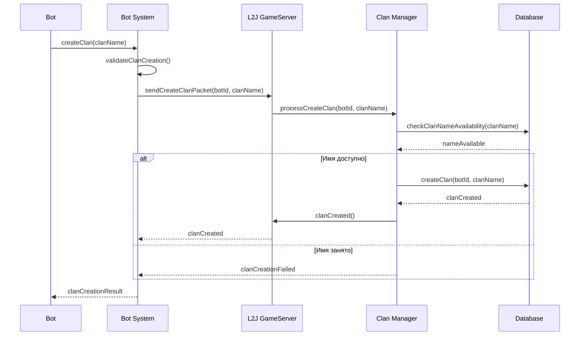
```mermaid
sequenceDiagram
    participant Bot as Bot
    participant BotSystem as Bot System
    participant L2JGameServer as L2J GameServer
    participant ClanManager as Clan Manager
    participant Database as Database

    Bot->>BotSystem: createClan(clanName)
    BotSystem->>BotSystem: validateClanCreation()
    
    BotSystem->>L2JGameServer: sendCreateClanPacket(botId, clanName)
    L2JGameServer->>ClanManager: processCreateClan(botId, clanName)
    
    ClanManager->>Database: checkClanNameAvailability(clanName)
    Database-->>ClanManager: nameAvailable
    
    alt Имя доступно
        ClanManager->>Database: createClan(botId, clanName)
        Database-->>ClanManager: clanCreated
        ClanManager->>L2JGameServer: clanCreated()
        L2JGameServer-->>BotSystem: clanCreated
    else Имя занято
        ClanManager-->>BotSystem: clanCreationFailed
    end
    
    BotSystem-->>Bot: clanCreationResult
```

### Присоединение к клану

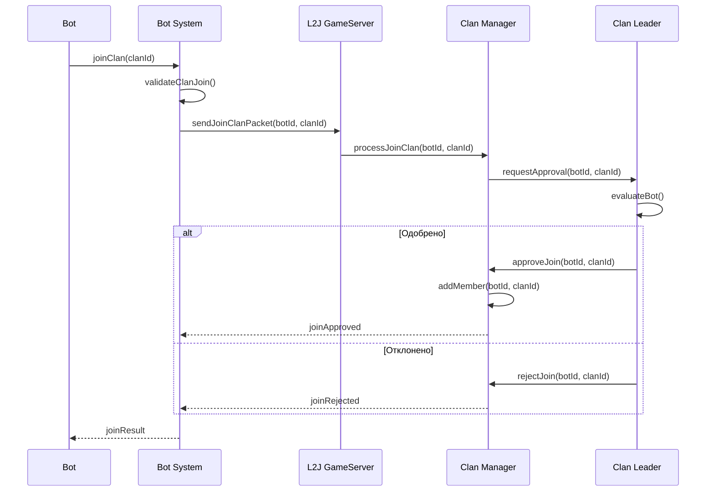
```mermaid
sequenceDiagram
    participant Bot as Bot
    participant BotSystem as Bot System
    participant L2JGameServer as L2J GameServer
    participant ClanManager as Clan Manager
    participant ClanLeader as Clan Leader

    Bot->>BotSystem: joinClan(clanId)
    BotSystem->>BotSystem: validateClanJoin()
    
    BotSystem->>L2JGameServer: sendJoinClanPacket(botId, clanId)
    L2JGameServer->>ClanManager: processJoinClan(botId, clanId)
    
    ClanManager->>ClanLeader: requestApproval(botId, clanId)
    ClanLeader->>ClanLeader: evaluateBot()
    
    alt Одобрено
        ClanLeader->>ClanManager: approveJoin(botId, clanId)
        ClanManager->>ClanManager: addMember(botId, clanId)
        ClanManager-->>BotSystem: joinApproved
    else Отклонено
        ClanLeader->>ClanManager: rejectJoin(botId, clanId)
        ClanManager-->>BotSystem: joinRejected
    end
    
    BotSystem-->>Bot: joinResult
```

## 🎯 Система квестов

### Принятие квеста

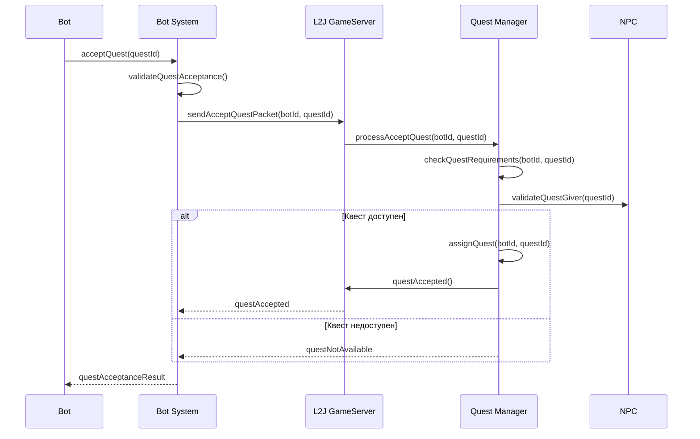
```mermaid
sequenceDiagram
    participant Bot as Bot
    participant BotSystem as Bot System
    participant L2JGameServer as L2J GameServer
    participant QuestManager as Quest Manager
    participant NPC as NPC

    Bot->>BotSystem: acceptQuest(questId)
    BotSystem->>BotSystem: validateQuestAcceptance()
    
    BotSystem->>L2JGameServer: sendAcceptQuestPacket(botId, questId)
    L2JGameServer->>QuestManager: processAcceptQuest(botId, questId)
    
    QuestManager->>QuestManager: checkQuestRequirements(botId, questId)
    QuestManager->>NPC: validateQuestGiver(questId)
    
    alt Квест доступен
        QuestManager->>QuestManager: assignQuest(botId, questId)
        QuestManager->>L2JGameServer: questAccepted()
        L2JGameServer-->>BotSystem: questAccepted
    else Квест недоступен
        QuestManager-->>BotSystem: questNotAvailable
    end
    
    BotSystem-->>Bot: questAcceptanceResult
```

### Завершение квеста

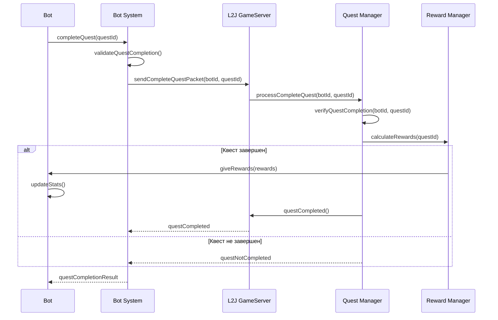
```mermaid
sequenceDiagram
    participant Bot as Bot
    participant BotSystem as Bot System
    participant L2JGameServer as L2J GameServer
    participant QuestManager as Quest Manager
    participant RewardManager as Reward Manager

    Bot->>BotSystem: completeQuest(questId)
    BotSystem->>BotSystem: validateQuestCompletion()
    
    BotSystem->>L2JGameServer: sendCompleteQuestPacket(botId, questId)
    L2JGameServer->>QuestManager: processCompleteQuest(botId, questId)
    
    QuestManager->>QuestManager: verifyQuestCompletion(botId, questId)
    QuestManager->>RewardManager: calculateRewards(questId)
    
    alt Квест завершен
        RewardManager->>Bot: giveRewards(rewards)
        Bot->>Bot: updateStats()
        QuestManager->>L2JGameServer: questCompleted()
        L2JGameServer-->>BotSystem: questCompleted
    else Квест не завершен
        QuestManager-->>BotSystem: questNotCompleted
    end
    
    BotSystem-->>Bot: questCompletionResult
```

## 🔄 Синхронизация состояния

### Синхронизация с клиентами

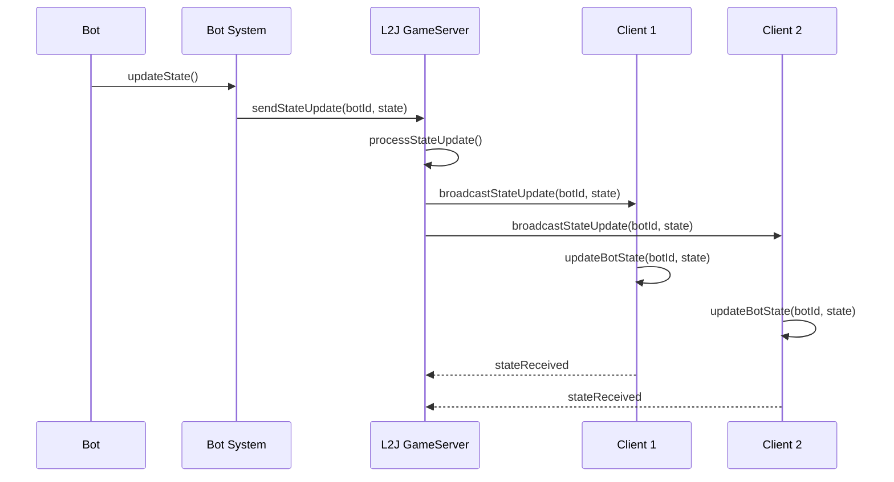
```mermaid
sequenceDiagram
    participant Bot as Bot
    participant BotSystem as Bot System
    participant L2JGameServer as L2J GameServer
    participant Client1 as Client 1
    participant Client2 as Client 2

    Bot->>BotSystem: updateState()
    BotSystem->>L2JGameServer: sendStateUpdate(botId, state)
    
    L2JGameServer->>L2JGameServer: processStateUpdate()
    L2JGameServer->>Client1: broadcastStateUpdate(botId, state)
    L2JGameServer->>Client2: broadcastStateUpdate(botId, state)
    
    Client1->>Client1: updateBotState(botId, state)
    Client2->>Client2: updateBotState(botId, state)
    
    Client1-->>L2JGameServer: stateReceived
    Client2-->>L2JGameServer: stateReceived
```

## 🚨 Обработка ошибок

### Обработка сетевых ошибок

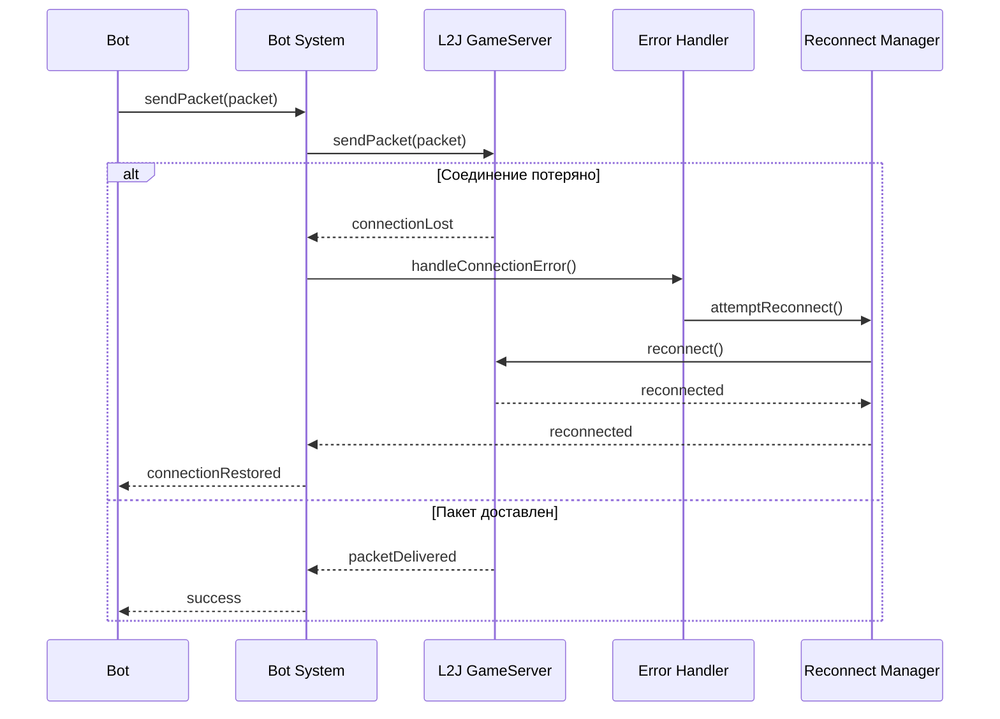
```mermaid
sequenceDiagram
    participant Bot as Bot
    participant BotSystem as Bot System
    participant L2JGameServer as L2J GameServer
    participant ErrorHandler as Error Handler
    participant ReconnectManager as Reconnect Manager

    Bot->>BotSystem: sendPacket(packet)
    BotSystem->>L2JGameServer: sendPacket(packet)
    
    alt Соединение потеряно
        L2JGameServer-->>BotSystem: connectionLost
        BotSystem->>ErrorHandler: handleConnectionError()
        ErrorHandler->>ReconnectManager: attemptReconnect()
        
        ReconnectManager->>L2JGameServer: reconnect()
        L2JGameServer-->>ReconnectManager: reconnected
        ReconnectManager-->>BotSystem: reconnected
        BotSystem-->>Bot: connectionRestored
    else Пакет доставлен
        L2JGameServer-->>BotSystem: packetDelivered
        BotSystem-->>Bot: success
    end
```

## 📊 Мониторинг интеграции

### Отслеживание производительности

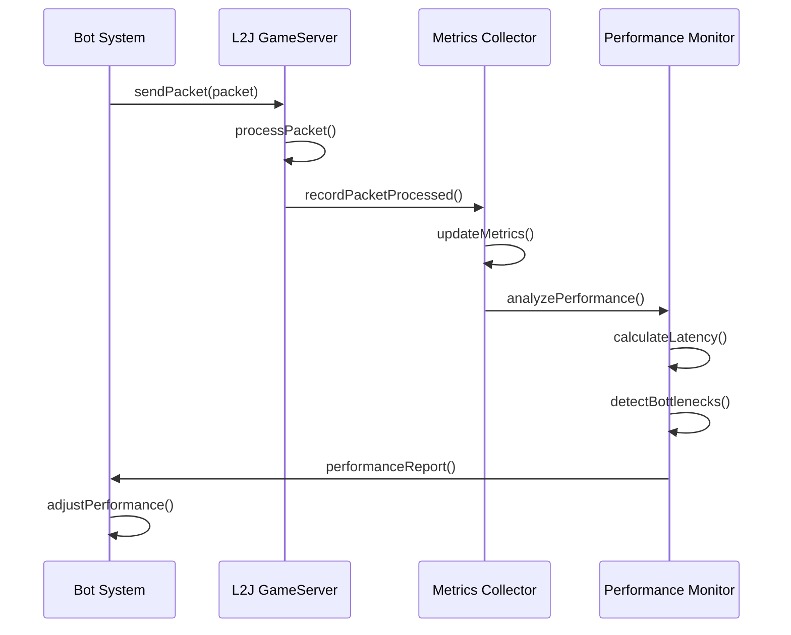
```mermaid
sequenceDiagram
    participant BotSystem as Bot System
    participant L2JGameServer as L2J GameServer
    participant MetricsCollector as Metrics Collector
    participant PerformanceMonitor as Performance Monitor

    BotSystem->>L2JGameServer: sendPacket(packet)
    L2JGameServer->>L2JGameServer: processPacket()
    
    L2JGameServer->>MetricsCollector: recordPacketProcessed()
    MetricsCollector->>MetricsCollector: updateMetrics()
    
    MetricsCollector->>PerformanceMonitor: analyzePerformance()
    PerformanceMonitor->>PerformanceMonitor: calculateLatency()
    PerformanceMonitor->>PerformanceMonitor: detectBottlenecks()
    
    PerformanceMonitor->>BotSystem: performanceReport()
    BotSystem->>BotSystem: adjustPerformance()
```

## 🔧 Конфигурация интеграции

### Настройка подключения

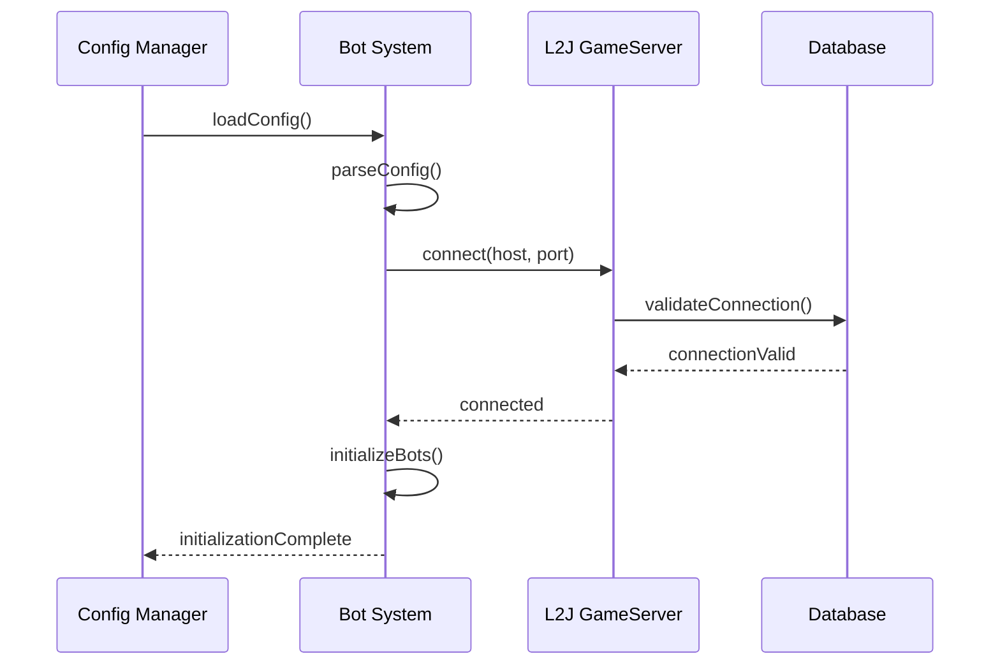
```mermaid
sequenceDiagram
    participant ConfigManager as Config Manager
    participant BotSystem as Bot System
    participant L2JGameServer as L2J GameServer
    participant Database as Database

    ConfigManager->>BotSystem: loadConfig()
    BotSystem->>BotSystem: parseConfig()
    
    BotSystem->>L2JGameServer: connect(host, port)
    L2JGameServer->>Database: validateConnection()
    Database-->>L2JGameServer: connectionValid
    L2JGameServer-->>BotSystem: connected
    
    BotSystem->>BotSystem: initializeBots()
    BotSystem-->>ConfigManager: initializationComplete
```

## 📝 Заключение

### Ключевые принципы интеграции:

1. **Асинхронность** - все операции выполняются асинхронно
2. **Валидация** - все данные проверяются перед отправкой
3. **Обработка ошибок** - система устойчива к сбоям
4. **Мониторинг** - производительность отслеживается
5. **Масштабируемость** - система поддерживает множество ботов

### Следующие шаги:
- Реализация протокола обмена данными
- Создание системы аутентификации ботов
- Разработка системы синхронизации состояния
- Интеграция с базой данных L2J

