# 🤝 Контракты взаимодействий системы ботов

## 📋 Обзор

Этот документ содержит sequence диаграммы, визуализирующие контракты взаимодействия между различными компонентами системы ботов L2J.

## 🏗️ Создание бота

### Основной процесс создания бота

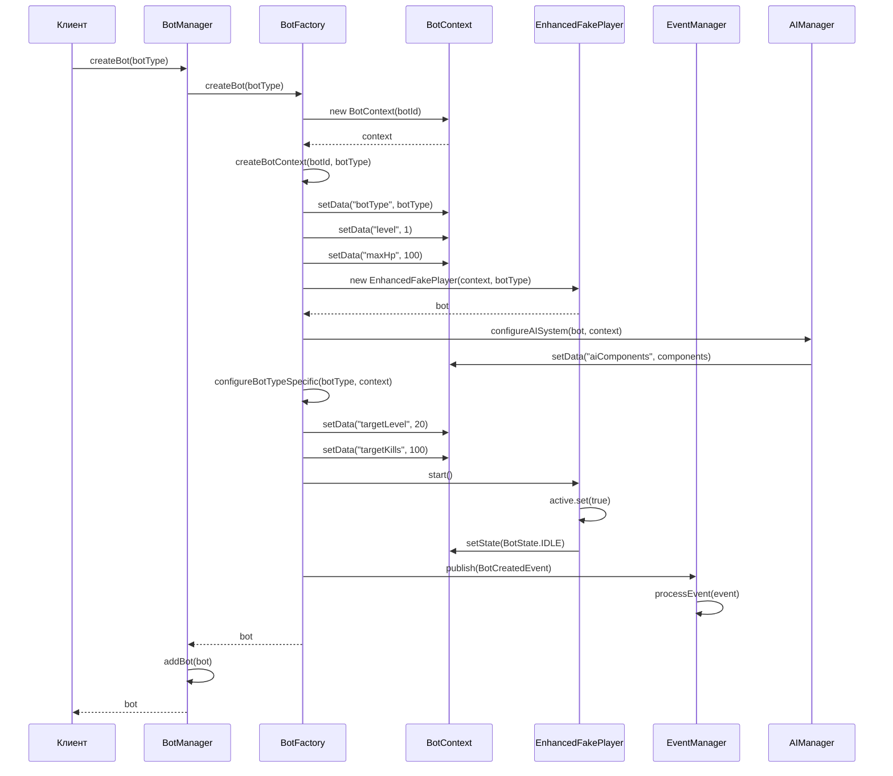

### Обработка ошибок при создании бота

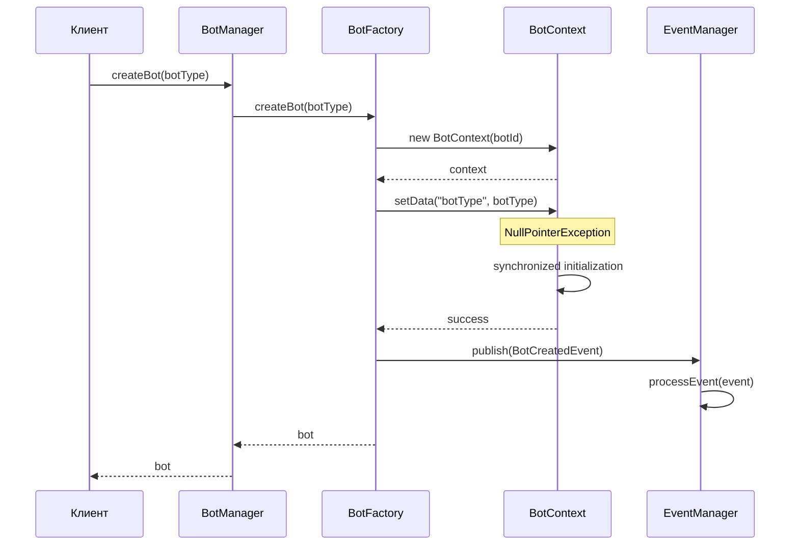

## 🎯 AI система принятия решений

### Процесс принятия решения ботом

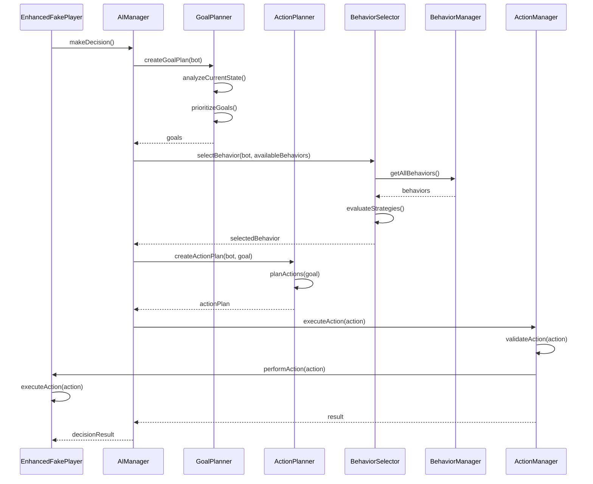

### Переключение поведения бота

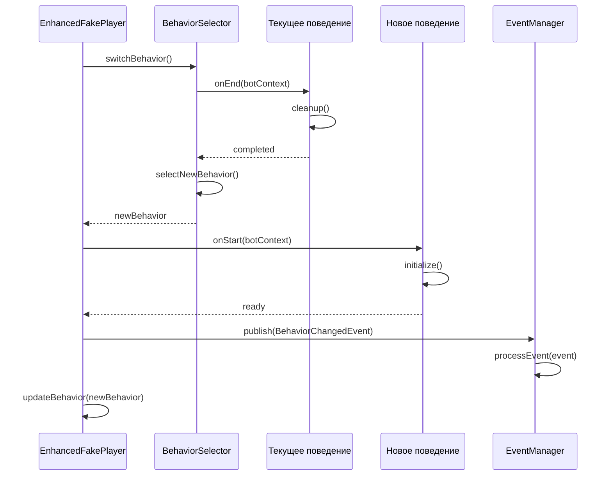

## 📡 Система событий

### Публикация и обработка событий

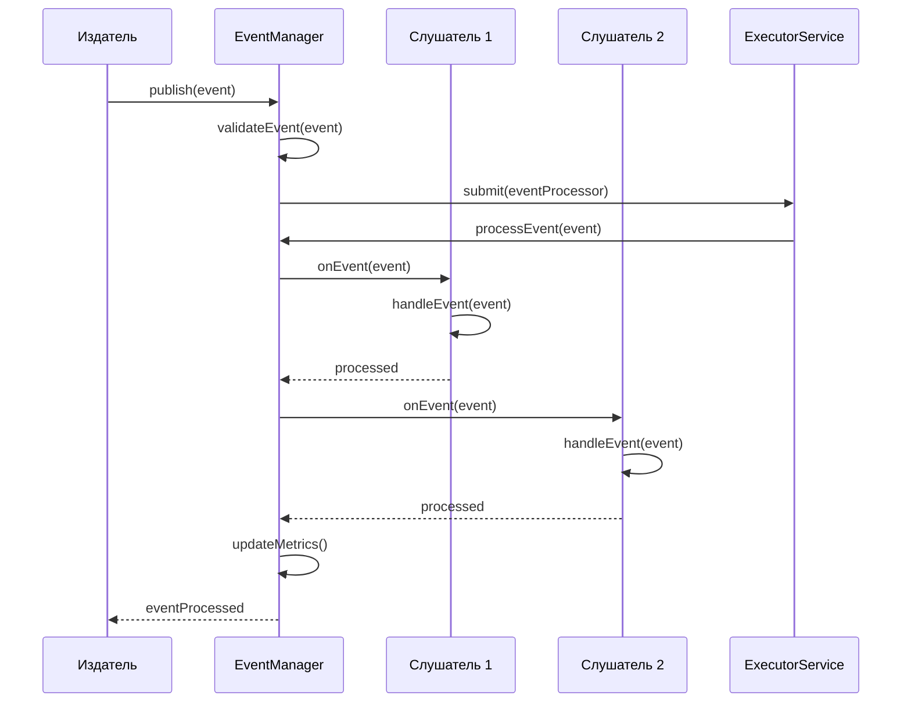

### Подписка на события

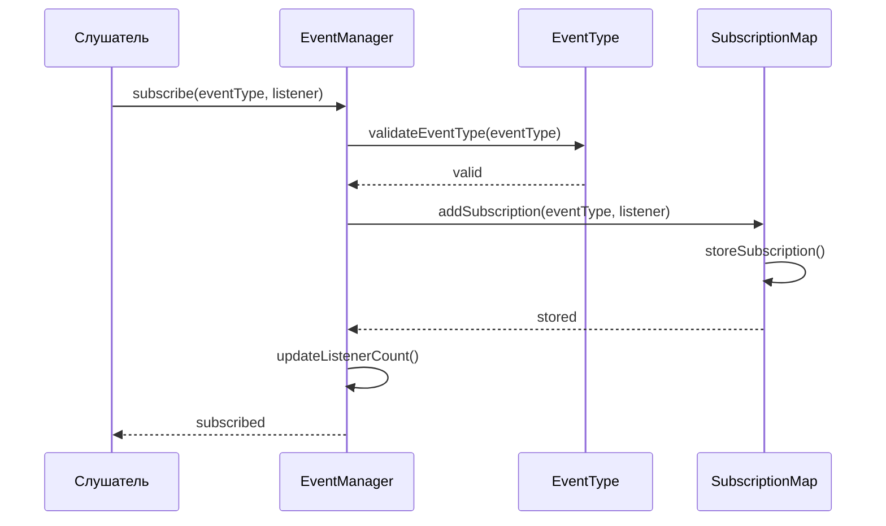

## 🔄 Жизненный цикл бота

### Полный жизненный цикл бота

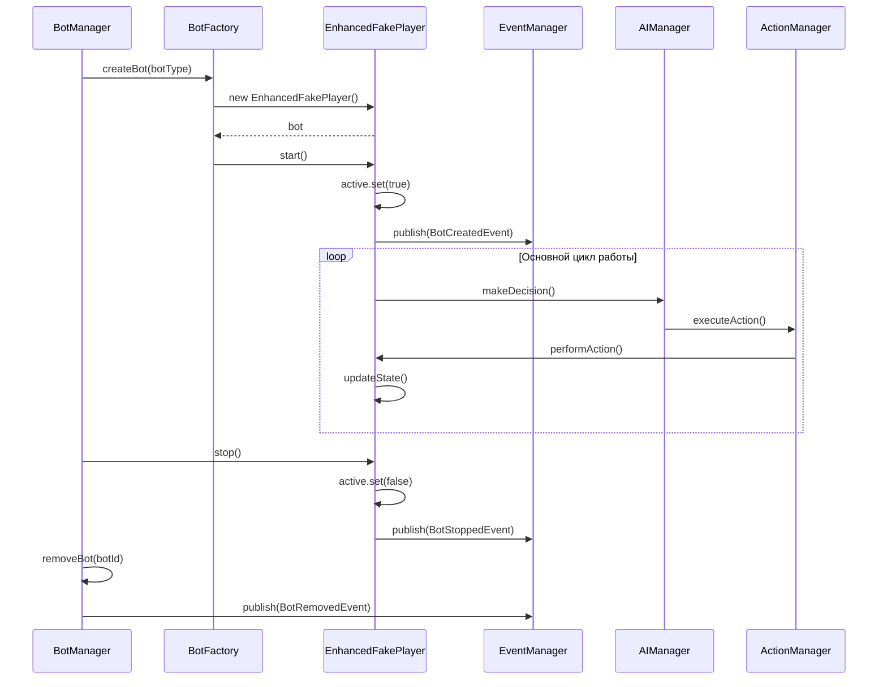

## 🎮 Игровые действия

### Выполнение игрового действия

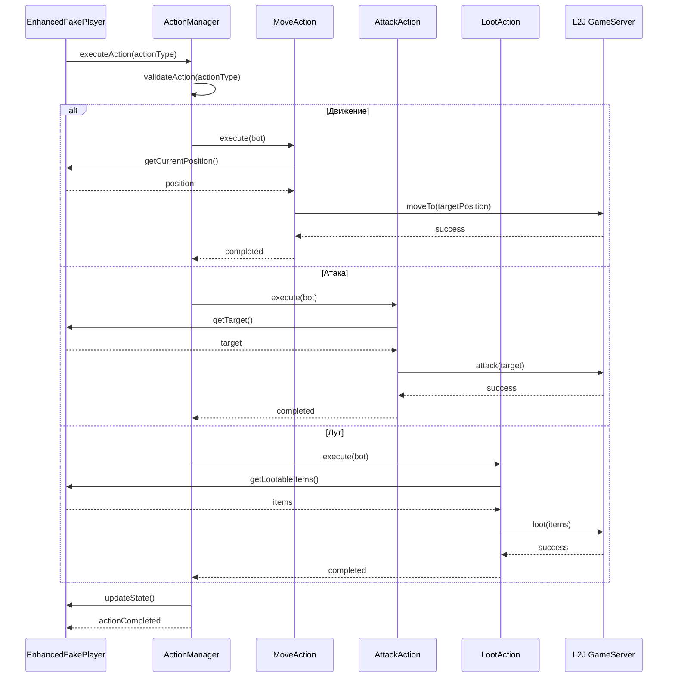

## 📊 Мониторинг и метрики

### Сбор метрик системы

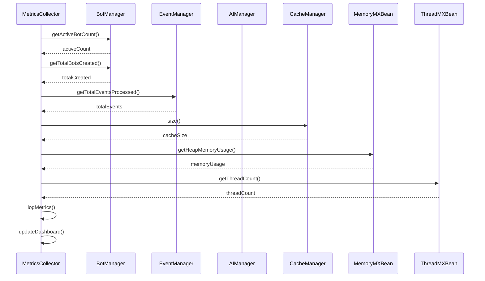

## 🔧 Обработка ошибок

### Обработка исключений в системе

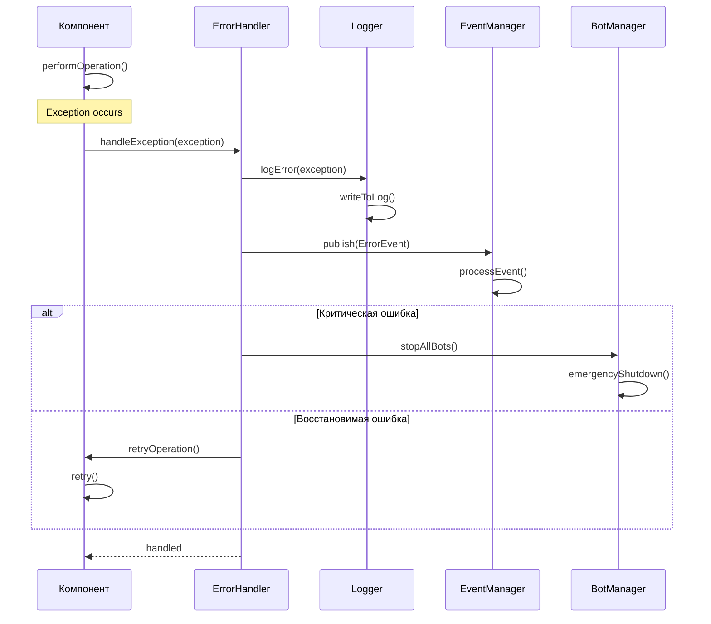

## 🎯 Специализированные контракты

### Контракт Farmer бота

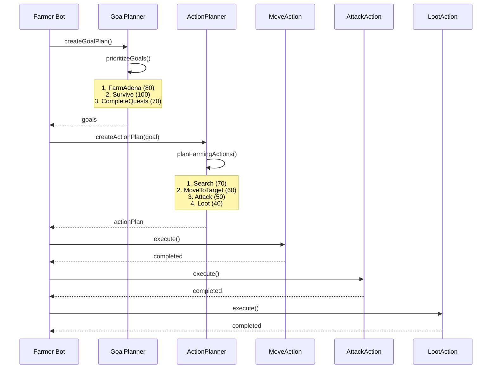

### Контракт Quester бота

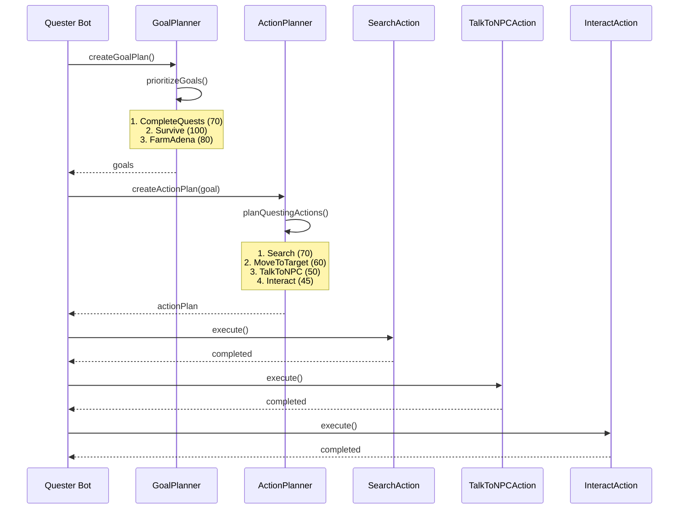

## 📝 Примечания

### Условные обозначения:
- **Сплошная стрелка** → Синхронный вызов
- **Пунктирная стрелка** - - - Асинхронный вызов
- **Note** 📝 Дополнительная информация
- **Alt** 🔀 Условная логика
- **Loop** 🔄 Циклические операции

### Ключевые принципы:
1. **Изоляция ошибок** - каждый компонент обрабатывает свои ошибки
2. **Асинхронность** - события обрабатываются асинхронно
3. **Валидация** - все входные данные проверяются
4. **Логирование** - все операции логируются
5. **Метрики** - производительность отслеживается

### Расширение контрактов:
- Новые типы ботов добавляют свои специфичные диаграммы
- Новые действия расширяют существующие контракты
- Система событий позволяет добавлять новые типы событий

