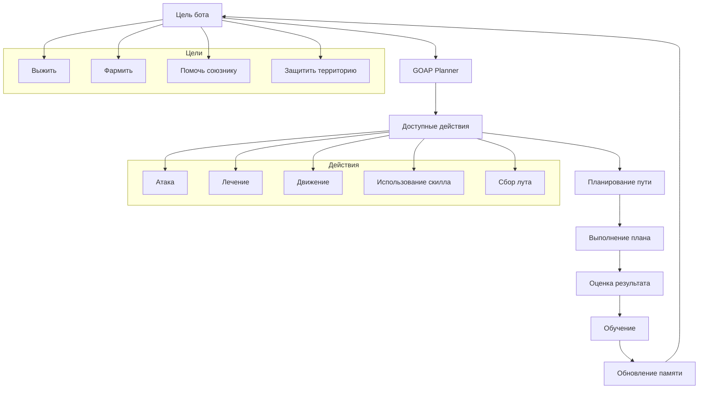

# 🧠 GOAP Планировщик

## Принцип работы



## Структура данных

### Цели (Goals)
```java
public class BotGoal {
    String name;
    int priority;
    Map<String, Object> conditions;
    boolean isAchieved(WorldState worldState);
}
```

### Действия (Actions)
```java
public class BotAction {
    String name;
    int cost;
    Map<String, Object> preconditions;
    Map<String, Object> effects;
    boolean canExecute(WorldState worldState);
    void execute(Bot bot);
}
```

### Состояние мира (WorldState)
```java
public class WorldState {
    Bot bot;
    List<L2Character> nearbyEnemies;
    List<L2Character> nearbyAllies;
    L2Character target;
    int healthPercent;
    int manaPercent;
    L2ItemInstance weapon;
    // ... другие параметры
}
```

## Алгоритм планирования

1. **Анализ текущего состояния** - сбор информации о мире
2. **Выбор цели** - определение приоритетной цели
3. **Поиск действий** - нахождение доступных действий
4. **Планирование пути** - построение последовательности действий
5. **Выполнение** - выполнение первого действия из плана
6. **Оценка** - анализ результата и корректировка

## Обучение и адаптация

- **Q-Learning** для оценки эффективности действий
- **Нейронные сети** для предсказания результатов
- **Генетические алгоритмы** для оптимизации стратегий
- **Статистический анализ** для выявления паттернов
