# 🧠 Паттерны обучения ботов

## 📋 Обзор

Этот документ описывает различные паттерны обучения для разных типов ботов в системе L2J Bot System.

## 🎯 Типы паттернов обучения

### 1. Farmer Bot - Паттерн фарма ресурсов

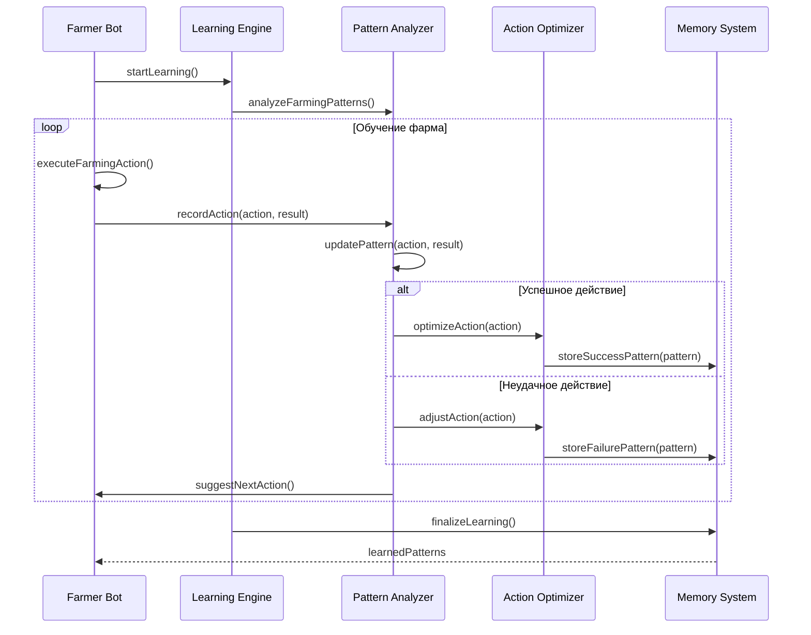

### 2. Quester Bot - Паттерн выполнения квестов

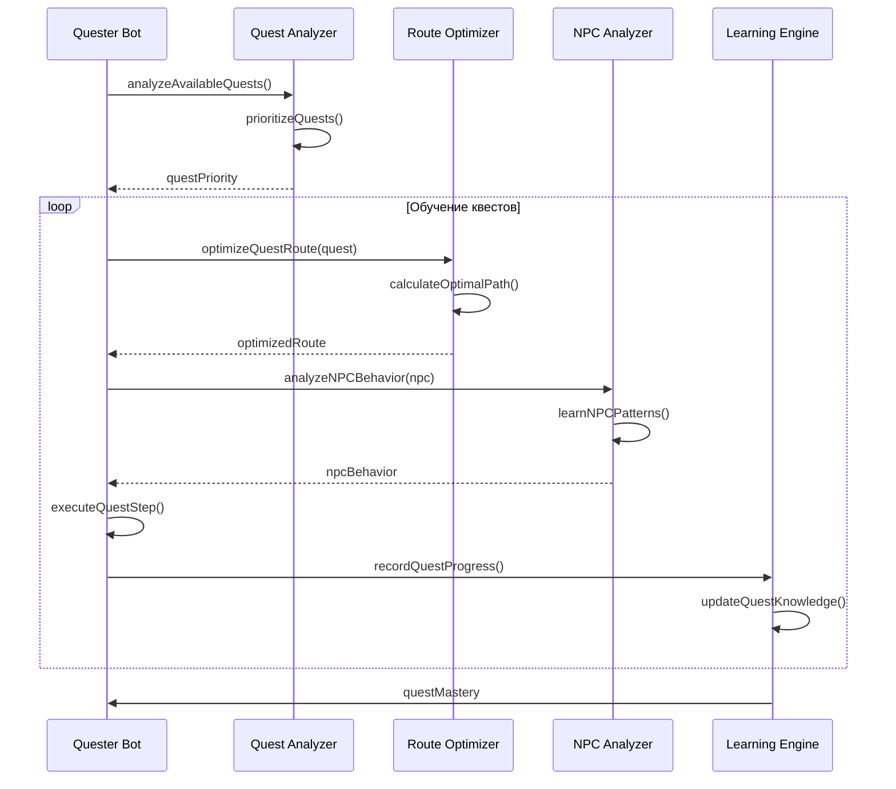

### 3. PvP Bot - Паттерн боевой системы

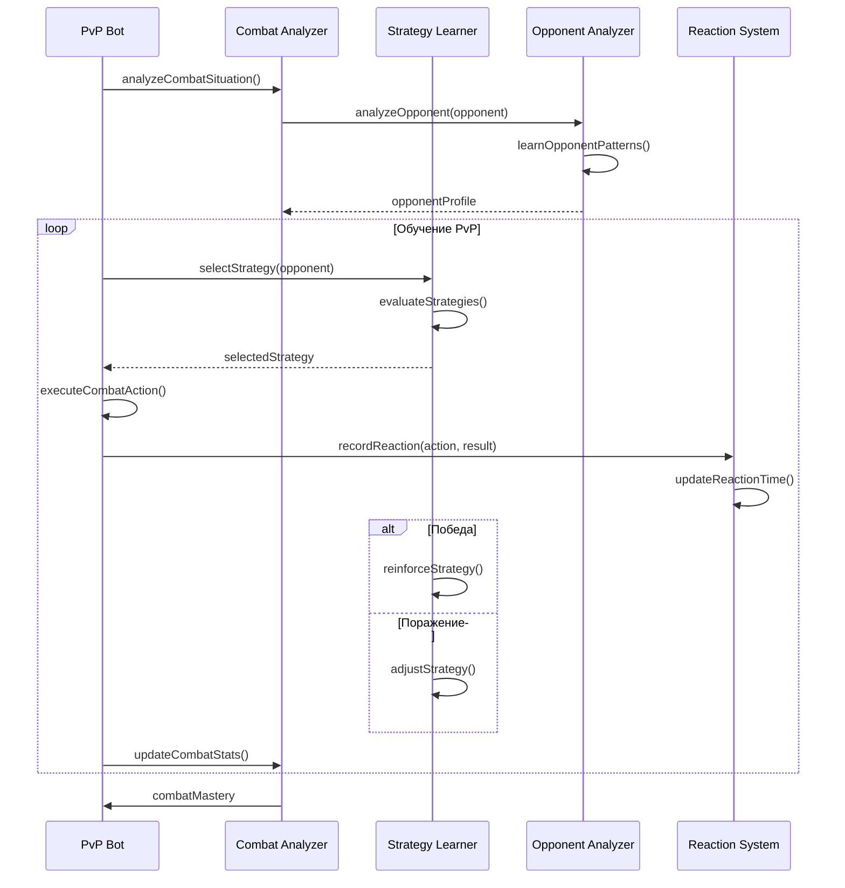

### 4. Support Bot - Паттерн поддержки группы

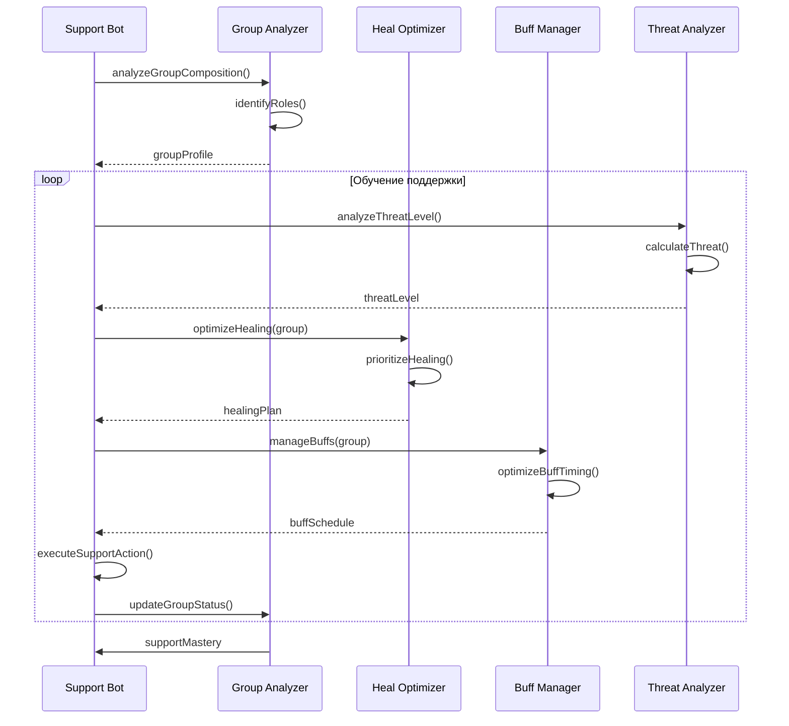

## 🔄 Адаптивное обучение

### Система адаптации к изменениям

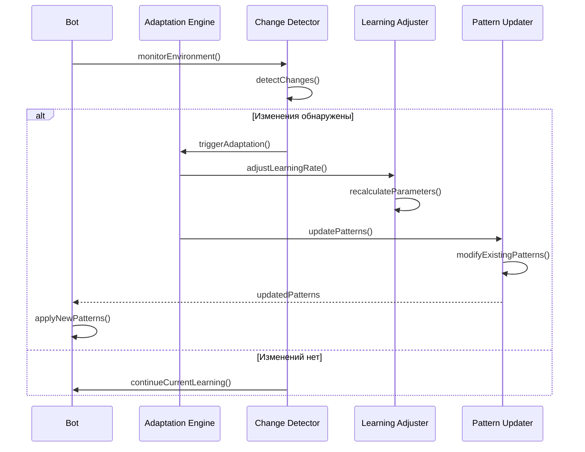

### Эволюция стратегий

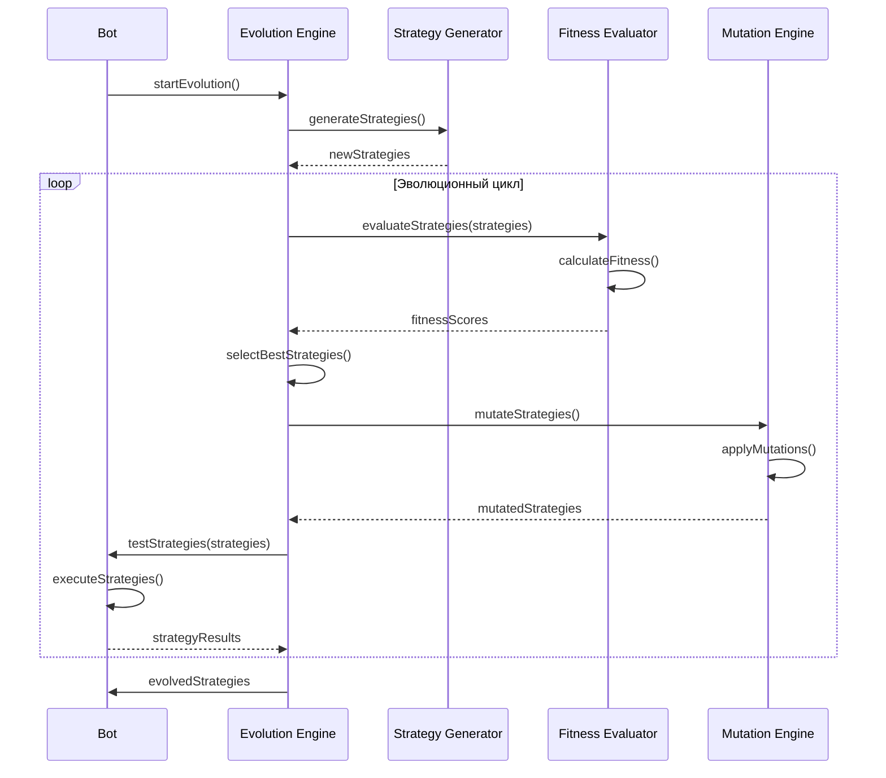

## 🧩 Коллективное обучение

### Обмен знаниями между ботами

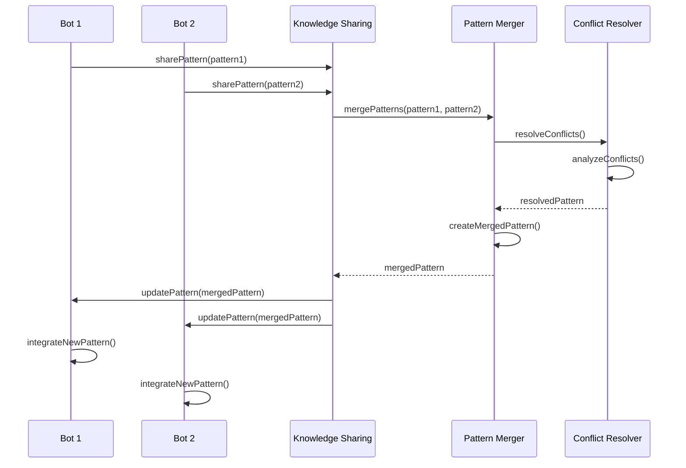

### Обучение на опыте других ботов

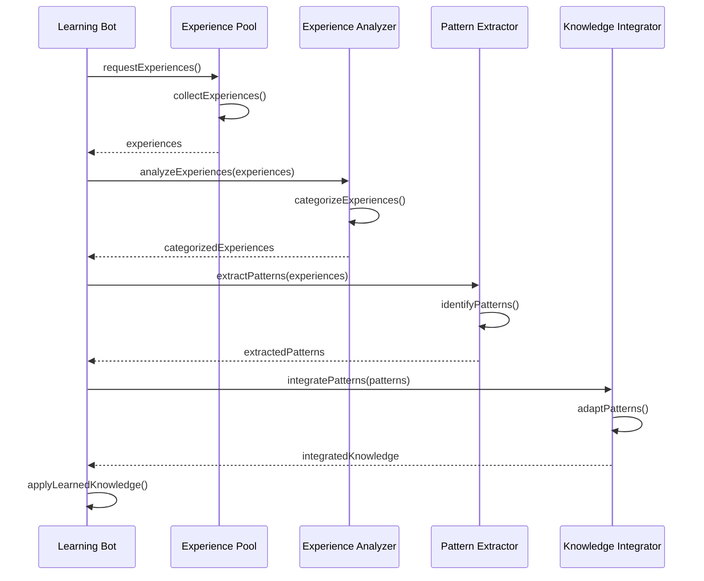

## 📊 Метрики обучения

### Отслеживание прогресса обучения

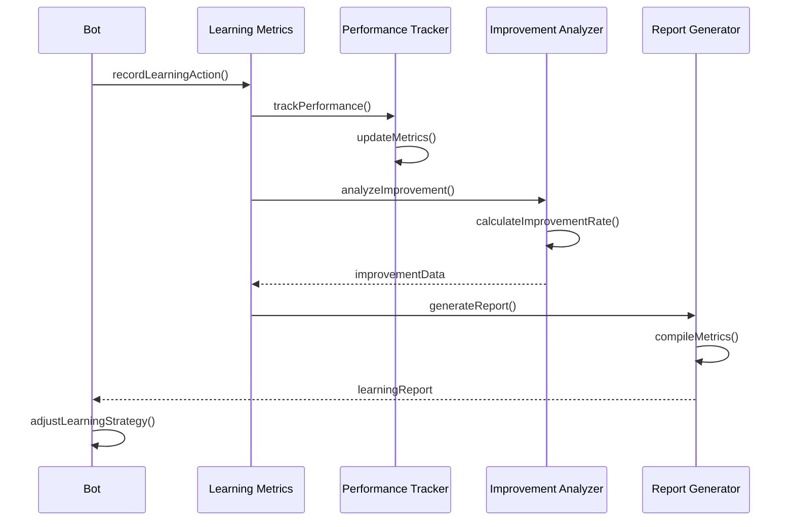

## 🎯 Специализированные паттерны

### Паттерн исследования новых территорий

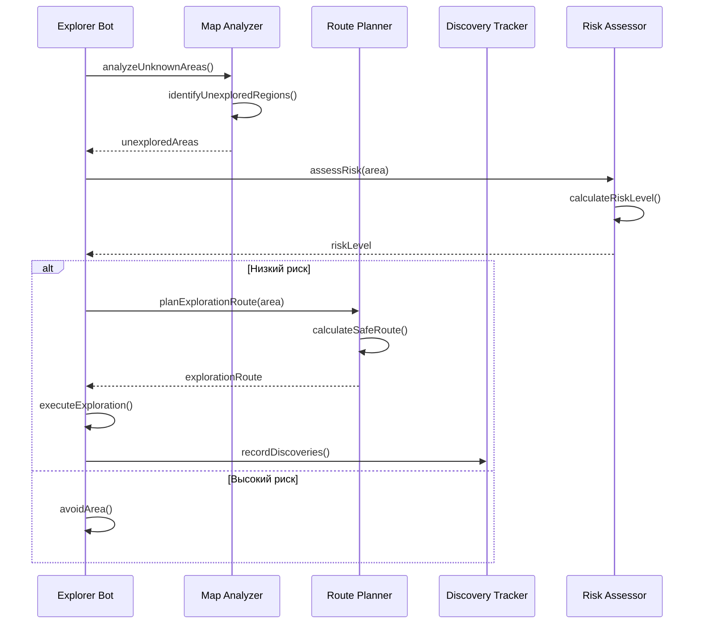

### Паттерн торговли и экономики

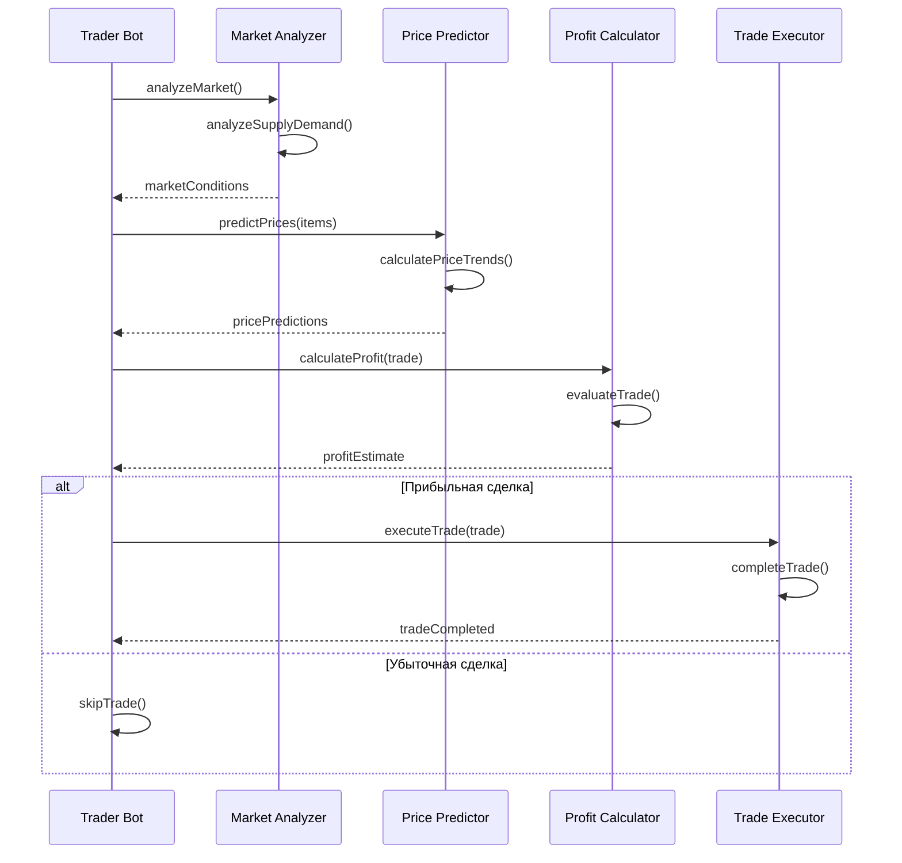

## 🔧 Настройка параметров обучения

### Конфигурация скорости обучения

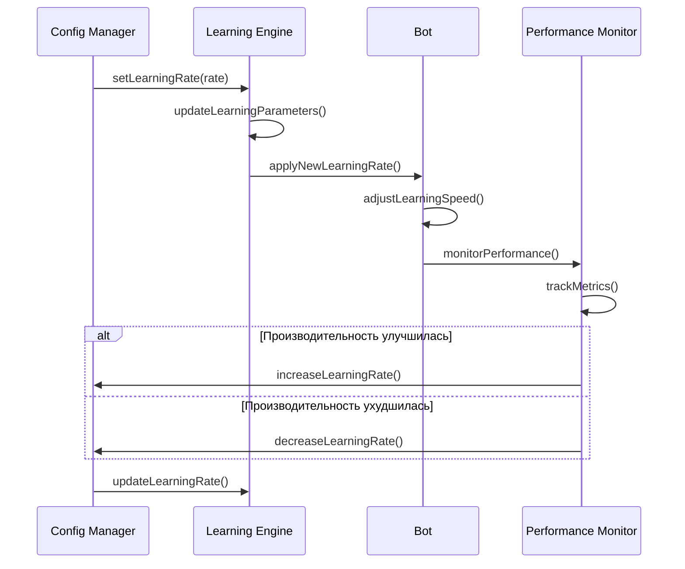

## 📝 Заключение

### Ключевые принципы обучения:

1. **Адаптивность** - боты адаптируются к изменениям в игре
2. **Специализация** - каждый тип бота имеет свои паттерны обучения
3. **Коллективность** - боты учатся друг у друга
4. **Эволюция** - стратегии развиваются и улучшаются
5. **Мониторинг** - прогресс обучения отслеживается и анализируется

### Следующие шаги:
- Реализация системы машинного обучения
- Создание нейронных сетей для принятия решений
- Разработка алгоритмов эволюции стратегий
- Интеграция с системой памяти ботов

