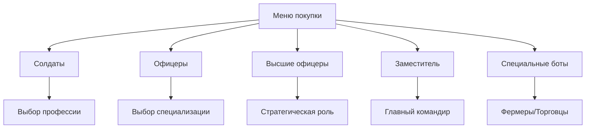
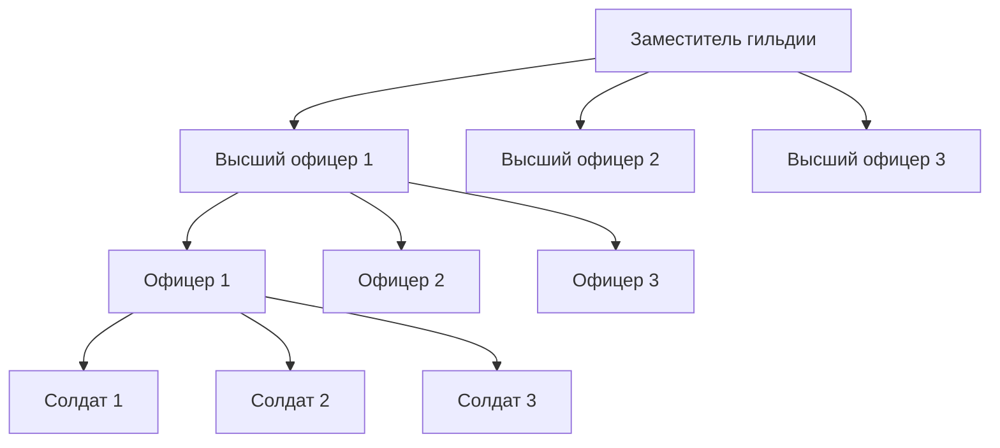

# 🤖 Система ботов для замков

## Обзор системы

Система ботов для замков предоставляет комплексное решение для автоматизации защиты и управления замками в Lineage 2. Боты могут выполнять различные роли: от рядовых солдат до стратегических командиров.

## 🏗️ Архитектура системы

### Структура компонентов
```
net.sf.l2j.botmanager
├── core/           # Ядро системы
│   ├── BotType.java        # Типы ботов
│   ├── BotState.java       # Состояния ботов
│   ├── BotContext.java     # Контекст бота
│   └── BotException.java   # Исключения
├── managers/       # Менеджеры
│   ├── BotManager.java     # Управление ботами
│   └── EventManager.java   # События
├── castle/         # Управление замками
│   ├── CastleBotManager.java    # Менеджер ботов замка
│   ├── CastleBotGroup.java      # Группа ботов замка
│   └── CastleMenuManager.java   # Меню замка
└── marketplace/    # Рынок ботов
    ├── BotMarketplace.java      # Рынок для игроков
    └── PersonalBotGroup.java    # Личные боты
```

## 🎭 Типы ботов

### 1. Солдат (SOLDIER)
- **Описание**: Рядовой боец для защиты замка
- **Функции**: Охрана территории, патрулирование, защита ворот
- **Стоимость**: 500,000 адены
- **Лимит**: Неограниченно

### 2. Офицер (OFFICER)
- **Описание**: Командир группы солдат
- **Функции**: Координация солдат, тактическое командование
- **Стоимость**: 2,000,000 адены
- **Лимит**: 10 офицеров

### 3. Высший офицер (HIGH_OFFICER)
- **Описание**: Стратегический командир
- **Функции**: Планирование обороны, управление офицерами
- **Стоимость**: 10,000,000 адены
- **Лимит**: 3 офицера

### 4. Заместитель гильдии (VICE_GUILDMASTER)
- **Описание**: Главный стратег
- **Функции**: Общее командование, организация ресурсов
- **Стоимость**: 50,000,000 адены
- **Лимит**: 1 бот

### 5. Фермер (FARMER)
- **Описание**: Сбор ресурсов
- **Функции**: Фарм мобов, сбор лута
- **Стоимость**: 300,000 адены
- **Лимит**: 5 фермеров

### 6. Торговец (MERCHANT)
- **Описание**: Торговля ресурсами
- **Функции**: Продажа предметов, покупка материалов
- **Стоимость**: 800,000 адены
- **Лимит**: 2 торговца

### 7. Стражник (GUARD)
- **Описание**: Охрана территории
- **Функции**: Патрулирование, обнаружение угроз
- **Стоимость**: 400,000 адены
- **Лимит**: 3 стражника

## 🏰 Управление замками

### Меню владельца замка
Доступно через NPC в замке:

#### 1. Покупка ботов


#### 2. Управление осадой
- **Подготовка к осаде**: Активация всех ботов
- **Защита ворот**: Расстановка солдат у главных ворот
- **Защита стен**: Патрулирование стен замка
- **Контратака**: Активные действия против нападающих

#### 3. Мирное время
- **Патрулирование**: Регулярный осмотр территории
- **Сбор ресурсов**: Организованный фарм
- **Торговля**: Управление экономикой замка

#### 4. Семь печатей
- **Фарм Necropolis**: Организованный фарм подземелий
- **Фарм Catacombs**: Координация в катакомбах
- **Защита печатей**: Охрана контрольных точек

#### 5. Олимпиада
- **Подготовка**: Тренировка участников
- **Управление**: Координация боев

## 🛒 Рынок ботов для игроков

### Покупка ботов
- **Доступные типы**: Солдаты, Офицеры, Фермеры, Торговцы, Стражники
- **Цены**: От 300k до 2M адены
- **Лимиты**: Зависит от типа бота

### Управление ботами
```java
// Пример использования API
BotMarketplace marketplace = BotMarketplace.getInstance();

// Покупка бота
BotContext bot = marketplace.purchaseBot(player, BotType.SOLDIER, "MySoldier");

// Отправка в путешествие
marketplace.sendBotWithPlayer(player, bot.getBotId());

// Назначение задачи
marketplace.sendBotOnTask(player, bot.getBotId(), "farm_mobs");

// Возврат в режим ожидания
marketplace.returnBotToIdle(player, bot.getBotId());
```

### Лимиты для обычных игроков
| Тип бота | Лимит | Описание |
|----------|-------|----------|
| Солдат | 3 | Рядовые бойцы |
| Офицер | 1 | Командир группы |
| Фермер | 5 | Сбор ресурсов |
| Торговец | 2 | Экономика |
| Стражник | 3 | Охрана |

## ⚔️ Система командования

### Иерархия


### Командная структура
- **Заместитель гильдии**: Общее стратегическое командование
- **Высшие офицеры**: Координация тактических групп
- **Офицеры**: Управление группами солдат (по 9 ботов)
- **Солдаты**: Исполнение приказов

## 📊 Статистика и мониторинг

### Метрики системы
- **Количество активных ботов**
- **Успешность выполнения задач**
- **Эффективность обороны**
- **Экономическая активность**

### Мониторинг
```java
// Получение статистики
CastleBotManager castleManager = CastleBotManager.getInstance();
String stats = castleManager.getCastleBotStatistics(castleId);

// Получение статистики рынка
BotMarketplace marketplace = BotMarketplace.getInstance();
String marketStats = marketplace.getMarketStatistics();
```

## 🔧 Техническая реализация

### Система событий
```java
// Подписка на события
EventManager eventManager = EventManager.getInstance();
eventManager.subscribe(BotCreatedEvent.class, new IEventListener<BotCreatedEvent>() {
    @Override
    public void onEvent(BotCreatedEvent event) {
        // Обработка создания бота
        System.out.println("Bot created: " + event.getBotName());
    }
});
```

### Контекст бота
```java
public class BotContext {
    private final int botId;
    private final Map<String, Object> data;
    private final AtomicReference<BotState> state;

    // Методы управления состоянием и данными
    public void setState(BotState newState);
    public BotState getState();
    public void setData(String key, Object value);
    public <T> T getData(String key);
}
```

## 🚀 Интеграция с L2J

### GameServer интеграция
```java
public class GameServer {
    private final BotManager botManager;
    private final CastleBotManager castleManager;

    public void onGameStart() {
        // Инициализация систем ботов
        botManager = BotManager.getInstance();
        castleManager = CastleBotManager.getInstance();

        // Загрузка ботов из базы данных
        loadBotsFromDatabase();
    }
}
```

### Обработчики команд
- `castle_bot_purchase` - покупка ботов
- `castle_bot_siege` - управление осадой
- `castle_bot_peace` - мирное время
- `castle_bot_stats` - статистика

## 📈 Производительность

### Оптимизации
- **Object Pooling**: Переиспользование объектов ботов
- **Async Processing**: Асинхронная обработка событий
- **Caching**: Кэширование часто используемых данных
- **Thread Management**: Управление потоками

### Масштабируемость
- **Horizontal Scaling**: Поддержка нескольких серверов
- **Load Balancing**: Распределение нагрузки
- **Resource Management**: Управление ресурсами

## 🔮 Будущие улучшения

### Планируемые функции
- [ ] Система обучения ботов
- [ ] Продвинутый ИИ для тактических решений
- [ ] Интеграция с Discord для уведомлений
- [ ] Веб-интерфейс для управления
- [ ] API для внешних интеграций

### Технические улучшения
- [ ] Миграция на более новую версию Java
- [ ] Оптимизация алгоритмов поиска пути
- [ ] Улучшенная система кэширования
- [ ] Расширенная телеметрия

---

**Статус**: ✅ Активная разработка | **Версия**: 1.0 | **Последнее обновление**: 2024-01-XX
