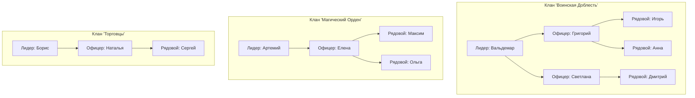
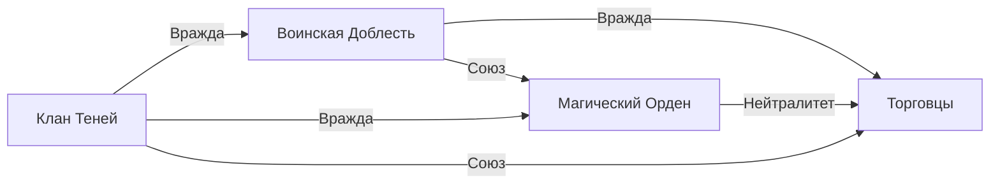

# 👥 Система кланов

## Структура кланов

## Отношения между кланами

## Иерархия ролей

### Лидер клана
- Принимает стратегические решения
- Управляет ресурсами клана
- Ведет переговоры с другими кланами
- Планирует крупные операции

### Офицеры
- Выполняют приказы лидера
- Управляют группами ботов
- Координируют тактические действия
- Обучают новых членов

### Рядовые члены
- Выполняют боевые задачи
- Участвуют в фарме
- Защищают территорию клана
- Собирают ресурсы

## Клановые активности

### Ежедневные
- Совместный фарм
- Тренировки
- Патрулирование территории

### Еженедельные
- Рейды на боссов
- PvP турниры
- Торговые операции

### Специальные
- Осады замков
- Захват территорий
- Межклановые войны
