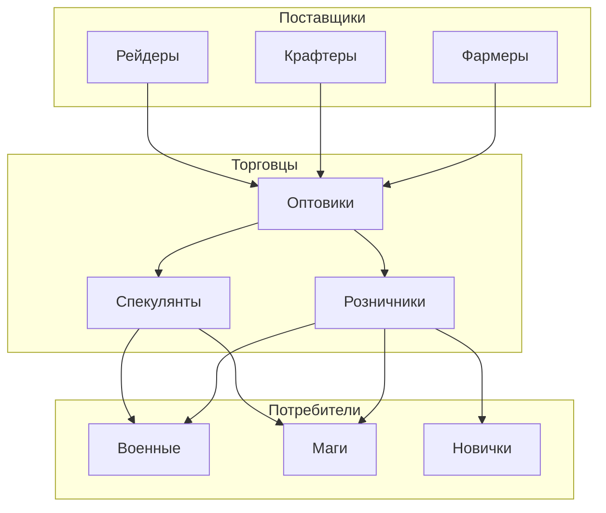
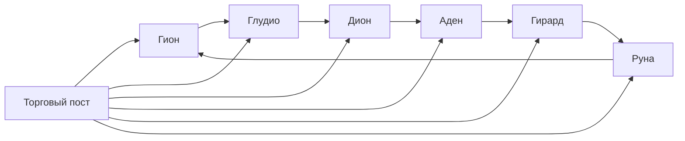

# 💰 Экономика между ботами

## Торговая система



## Ценообразование

### Факторы влияния на цены
- **Редкость предмета** - чем реже, тем дороже
- **Спрос** - популярность среди ботов
- **Предложение** - количество на рынке
- **Сезонность** - время года влияет на цены
- **События** - осады, рейды меняют спрос

### Алгоритм ценообразования
```java
public class PriceCalculator {
    public int calculatePrice(Item item) {
        double basePrice = item.getBasePrice();
        double rarityMultiplier = item.getRarity() * 2.0;
        double demandMultiplier = getDemandLevel(item);
        double supplyMultiplier = getSupplyLevel(item);
        double seasonMultiplier = getSeasonMultiplier();
        double eventMultiplier = getEventMultiplier();
        
        return (int)(basePrice * rarityMultiplier * 
                    demandMultiplier * supplyMultiplier * 
                    seasonMultiplier * eventMultiplier);
    }
}
```

## Торговые маршруты



## Специализация ботов

### Фармеры
- Собирают базовые ресурсы
- Продают сырье оптовикам
- Работают в безопасных зонах

### Крафтеры
- Создают предметы из сырья
- Специализируются по профессиям
- Продают готовую продукцию

### Торговцы
- Покупают и перепродают товары
- Изучают рынок и цены
- Перевозят товары между городами

### Рейдеры
- Добывают редкие предметы
- Работают в опасных зонах
- Продают уникальные вещи
