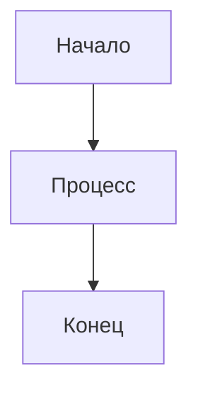
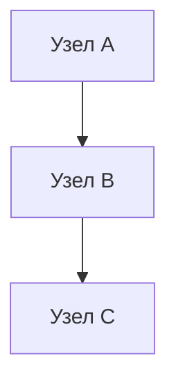
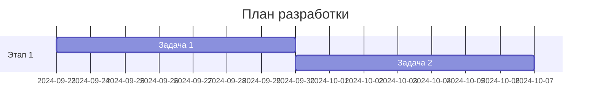
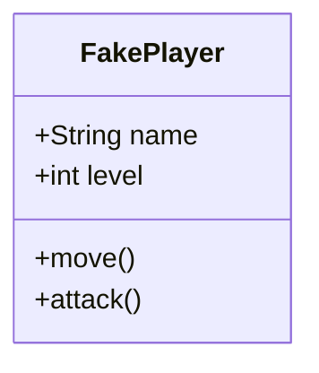
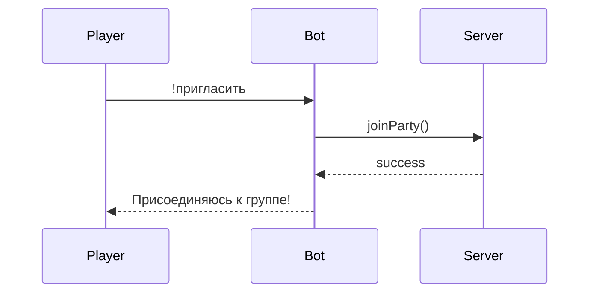

# 📚 Руководство по работе с Obsidian

## 🚀 Быстрый старт

1. **Откройте Obsidian** - приложение должно запуститься автоматически
2. **Выберите папку** - `/home/ni/Projects/la2bots/obsidian-vault`
3. **Начните с главной страницы** - `Главная-страница.md`

## 📊 Работа с диаграммами

### Mermaid диаграммы
Obsidian поддерживает диаграммы Mermaid из коробки. Просто используйте блоки кода:

````markdown

````

### Доступные типы диаграмм

#### 1. Блок-схемы (Flowchart)


#### 2. Диаграммы Ганта (Gantt)


#### 3. Диаграммы классов (Class)


#### 4. Диаграммы последовательности (Sequence)


## 🗂️ Структура документации

### 01-Планирование
- **Роадмапа-проекта.md** - временная шкала разработки
- **Техническое-задание.md** - детальные требования
- **Этапы-разработки.md** - пошаговое планирование

### 02-Архитектура
- **Архитектура-сервера.md** - общая схема системы
- **Схема-взаимодействий.md** - связи между компонентами
- **База-данных.md** - структура БД

### 03-ИИ-Система
- **GOAP-планировщик.md** - алгоритмы планирования
- **Система-обучения.md** - машинное обучение
- **Память-ботов.md** - система памяти

### 04-Боты
- **FakePlayer-класс.md** - базовый класс ботов
- **Поведение-ботов.md** - логика поведения
- **Роли-в-группе.md** - специализация ботов

### 05-Кланы
- **Система-кланов.md** - структура кланов
- **Дипломатия.md** - отношения между кланами
- **PvP-между-ботами.md** - боевая система

### 06-Игровые-Активности
- **Осады-замков.md** - осадная система
- **Рейды-на-боссов.md** - рейдовая система
- **Экономика.md** - торговая система

### 07-Тестирование
- **План-тестирования.md** - стратегия тестирования
- **Метрики-качества.md** - критерии качества
- **Отчеты-о-багах.md** - трекинг багов

### 08-Результаты
- **Демо-видео.md** - видео демонстрации
- **Скриншоты.md** - изображения интерфейса
- **Аналитика.md** - статистика и метрики

## 🔧 Полезные плагины

### Рекомендуемые плагины для проекта:

1. **Mermaid** - уже включен, для диаграмм
2. **Dataview** - для создания динамических списков
3. **Templater** - для шаблонов документов
4. **Calendar** - для планирования задач
5. **Kanban** - для управления задачами
6. **Mind Map** - для создания ментальных карт

### Установка плагинов:
1. Откройте настройки (Ctrl+,)
2. Перейдите в "Community plugins"
3. Отключите "Safe mode"
4. Найдите и установите нужные плагины

## 📝 Соглашения по документированию

### Структура файлов
- Используйте **заголовки** для разделения разделов
- Применяйте **эмодзи** для визуального разделения
- Создавайте **ссылки** между связанными документами

### Диаграммы
- Всегда добавляйте **описание** к диаграммам
- Используйте **понятные названия** для узлов
- Группируйте связанные элементы в **subgraph**

### Код
- Используйте **синтаксис Java** для примеров кода
- Добавляйте **комментарии** к сложным участкам
- Группируйте код по **функциональности**

## 🎯 Советы по работе

### Навигация
- Используйте **Ctrl+O** для быстрого поиска файлов
- Применяйте **Ctrl+Shift+F** для поиска по содержимому
- Создавайте **теги** для категоризации (#боты, #ии, #тестирование)

### Связи между документами
- Используйте **[[ссылки]]** для связи документов
- Создавайте **обратные ссылки** для навигации
- Применяйте **теги** для группировки

### Обновление документации
- **Регулярно обновляйте** статус задач
- **Добавляйте новые диаграммы** по мере разработки
- **Ведите журнал изменений** в важных файлах

## 🚀 Следующие шаги

1. **Изучите структуру** - ознакомьтесь с папками и файлами
2. **Начните с планирования** - откройте файлы из папки 01-Планирование
3. **Создайте свои диаграммы** - используйте Mermaid для визуализации идей
4. **Ведите документацию** - обновляйте файлы по мере разработки
5. **Совместная работа** - делитесь ссылками на документы с командой

---

*Этот vault создан для проекта "Lineage 2 Server с ИИ-ботами" и содержит всю необходимую документацию для успешной разработки.*

